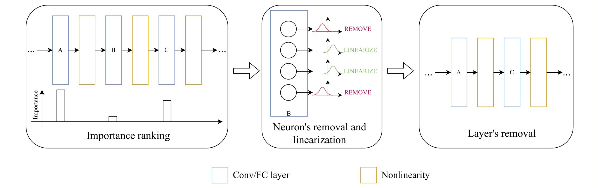

<div align="center">
  <div>
  <h1>Till the Layers Collapse: Compressing a Deep Neural Network Through the Lenses of Batch Normalization Layers</h1> 

[](https://arxiv.org/abs/2412.15077)
[]()

  </div>

</div>

<div align="center">

<div>
    <a href='https://scholar.google.com/citations?user=xjwYZvIAAAAJ&hl=fr&oi=ao' target='_blank'>Zhu Liao</a><sup>1</sup>&emsp;
    <a href='' target='_blank'>Nour Hezbri</a><sup>1</sup>&emsp;
    <a href='https://scholar.google.com/citations?hl=fr&user=wfwULQUAAAAJ' target='_blank'>Victor Quétu</a><sup>1</sup>&emsp;
    <a href='https://perso.telecom-paristech.fr/vtnguyen/' target='_blank'>Van-Tam Nguyen</a><sup>1</sup>&emsp;
    <a href='https://scholar.google.com/citations?hl=fr&user=uKuvN64AAAAJ' target='_blank'>Enzo Tartaglione</a><sup>1</sup>&emsp;  
</div>
<div>
<sup>1</sup>LTCI, Télécom Paris, Institut Polytechnique de Paris&emsp;  

</div>
</div> <br>

📣 Published as a conference paper at AAAI 2025.  <br>

This GitHub implements the key experiments of the following paper: [Till the Layers Collapse: Compressing a Deep Neural Network Through the Lenses of Batch Normalization Layers](https://arxiv.org/pdf/2412.15077.pdf), and more particularly of our method called **T**ill the **L**ayers **C**ollapse (**TLC**) to reduce the depth of over-parametrized deep neural networks.    

<p align="center">
  
</p>
<div align="center">
Overview of the key steps of TLC: identification of the layer to remove, removal of irrelevant channels, and linearization of the remaining, removal of the layer.
</div>

## Example Runs

To test TLC with MobileNetv2 on CIFAR-10 following the same policy as in the paper, you can run:

``` python TLC_MobileNetV2.py ```

To test TLC with ResNet-18 on another dataset, like VLCS, you can run:

```python TLC_ResNet18.py --dataset VLCS --DATA_DIR $DATASET_PATH  ```

Before executing, please ensure that the target dataset already exists on your machine.

## List of available datasets

- CIFAR-10
- Tiny-ImageNet-200
- PACS
- VLCS
- ImageNet
- QNLI
- RTE
- SST-2

## List of available architectures

- VGG-16 (bn version)
- ResNet-18
- Swin-T
- MobileNetv2
- BERT
- RoBERTa

## Extended version

Please find the extended version of the paper at [Till the Layers Collapse: Compressing a Deep Neural Network Through the Lenses of Batch Normalization Layers](https://arxiv.org/abs/2412.15077).

## Citation

If you find this useful for your research, please cite the following paper.
```
@article{liao2024till,
  title={Till the Layers Collapse: Compressing a Deep Neural Network through the Lenses of Batch Normalization Layers},
  author={Liao, Zhu and Hezbri, Nour and Qu{\'e}tu, Victor and Nguyen, Van-Tam and Tartaglione, Enzo},
  journal={arXiv preprint arXiv:2412.15077},
  year={2024}
}
```
